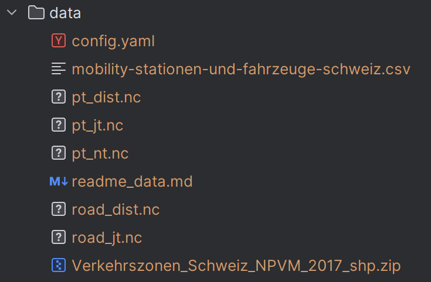

# Preparation of the data

Folder for large data files. These are not in git. They can be prepared as follows:

1. Download the following files:
    - ```mobility-stationen-und-fahrzeuge-schweiz.csv``` from https://data.opendatasoft.com/explore/dataset/mobility-stationen-und-fahrzeuge-schweiz%40stgallen/export/?disjunctive.reservationrules_minduration&disjunctive.reservationrules_maxduration&disjunctive.address_city&disjunctive.vehiclecategories_numberofvehicles&disjunctive.vehiclecategories_categorietripmodes&disjunctive.vehicle_type&sort=name
    - ```Verkehrszonen_Schweiz_NPVM_2017_shp.zip``` from https://zenodo.org/record/3381827#.Y7VH2nbMKUk
    - ```144_NTR_(OEV).mtx``` and ```140_JRTA_(OEV).mtx``` from https://opendata.swiss/de/dataset/kenngrossenmatrizen-2017
    - ```DWV_2017_ÖV_Distanz_CH_binär.mtx```, ```DWV_2017_ÖV_Reisezeit_CH_binär.mtx```, ```DWV_2017_Strasse_Distanz_CH_binär.mtx``` and
      ```DWV_2017_Strasse_Reisezeit_CH_binär.mtx``` from https://zenodo.org/records/7777651
2. Prepare the filtered skim files with by executing the cells until chapter
   ```Filter skims to mobility station and write files to disk``` in ```notebooks\data_preparation```
3. Create a ```config.yaml``` file  with the following content:
```ojp_api_key: <YOUR_OJP_API_TOKEN>``` (to receive such a token go to https://opentransportdata.swiss/de/cookbook/open-journey-planner-ojp/)

Finally, the following files are necessary to run the application and must be placed in the ```data``` folder:

