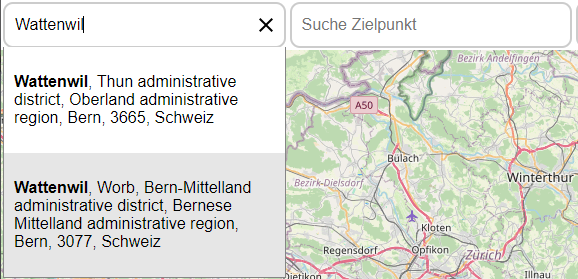
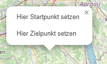
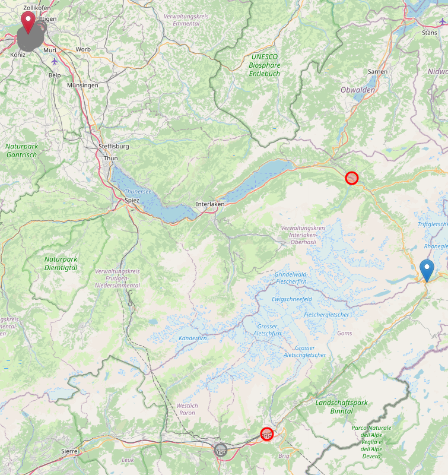
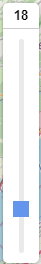
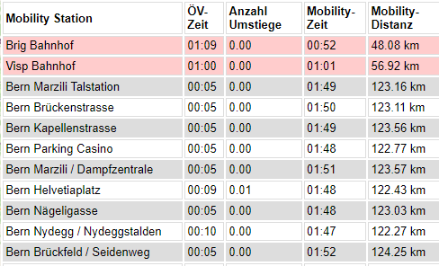
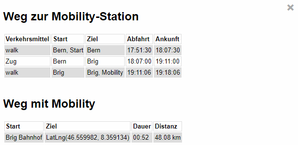

Wer eine Reise von A nach B plant und dabei den <a href="https://www.mobility.ch/de">Car-Sharing-Anbieter Mobility</a> nutzen möchte, steht oft vor der Frage, an welcher Mobility-Station das Auto angemietet werden soll. Möglichst nah von zu Hause? Das kann teuer werden (da ein Mobility-Kilometer einiges kostet). Oder möglichst nahe am Ziel? Das kann lange dauern (da der öV nicht immer schnell ist). Oder gibt es vielleicht irgendwo dazwischen eine Mobility-Station, wo der Trade-off zwischen Kosten und Zeit für die persönliche Situation, in welcher man sich gerade befindet, in der Balance ist?

Die Beantwortung dieser Frage(n) hängt von verschiedensten Parametern ab, z.B.:
- der effektiven öV-Verbindung von zu Hause zur Mobility-Station,
- den Kosten, welche für die mit dem Mobility zurückgelegte Wegstrecke anfallen,
- der persönlichen Zahlungsbereitschaft resp. umgekehrt der Bereitschaft, eine längere Fahrt in Kauf zu nehmen.

Die Webseite <a href="https://mobility-station-finder.ch/">mobility-station-finder.ch</a> soll es Mobility-Nutzern erleichtert, diese Frage(n) zu beantworten. Und zwar indem alle relevanten Informationen auf einer Webseite zur Verfügung gestellt werden. Damit entfällt das lästige Wechseln zwischen verschiedenen Webseiten (z.B. Mobility-Webseite, SBB-App, Google Maps).

Zu beachten:
- Die Webseite verwendet nur öffentlich zugängliche Daten und kostenlose Services (siehe weiter unten). Die Qualtität dieser Daten resp. Services ist nicht immer so gut, wie dies bei zahlungspflichtigen Diensten der Fall sein kann. Entsprechend ist bei der Interpretation Vorsicht geboten.
- Das Projekt ist auf eine private Initiative hin entstanden und verfolgt keinen kommerziellen Hintergrund. Für die Resultate wird selbstverständlich keine Haftung übernommen.
- Der Source-Code ist auf <a href="https://github.com/jlieberherr/mobility-station-finder">github.com/jlieberherr/mobility-station-finder</a> unter einer <a href="https://github.com/jlieberherr/mobility-station-finder/blob/main/LICENSE">MIT-Lizenz</a> verfügbar.
- Start- und Zielpunkt müssen innerhalb der Schweiz liegen.
- Die Verfügbarkeit der Fahrzeuge an Mobility-Stationen wird nicht berücksichtigt.

# Anwendung
## Start und Ziel der Reise definieren
Start resp. Ziel der Reise können auf zwei Arten definiert werden:  
1) Adresssuche über die Felder "Suche Startpunkt" resp. "Suche Zielpunkt
  
2) Mausklick rechts auf den Punkt in der Karte, wo die Reise beginnen resp. enden soll

In beiden Fällen wird für den Start- resp. Zielpunkt ein Marker gesetzt (rot = Startpunkt, blau = Zielpunkt) und Koordinaten ermittelt, welche als Input für den Algorithmus dienen.

Die Position der Marker kann mit mittels drag-and-drop verschoben werden.

## Mobility-Stationen aufrufen
Sobald Start- und Zielpunkt der Reise definiert sind sowie eine gültige gewünschte Abfahrtszeit definiert ist, kann mittels Klick auf den "Suche"-Button die Suche für die Mobility-Station gestartet werden:  

Die gefundenen Mobility-Stationen werden jetzt auf der Karte als Kreise dargestellt:  

Zudem erscheint links ein Slider. Mit diesem Slider kann eingestellt werden, ob einem die Kosten oder die Zeit wichtig sind:  
  
Wenn die Kosten wichtig sind (tiefer Wert des Sliders), werden die dem Ziel am nächsten liegenden Mobility-Stationen rot eingefärbt (möglichst kurzer Mobility-Weg, sodass die Kosten gering sind).  
Wenn die Zeit wichtig ist (hoher Wert des Sliders), werden die Mobility-Stationen in der Nähe des Startes angezeigt (möglichst kurze Reisezeit, Kosten sind sekundär).  
Für Posititionen des Sliders dazwischen erscheinen jeweils die Mobility-Stationen in rot, welche für das gerade gesetzte Kosten-Zeit-Verhältnis optimal sind.

Via den Button  können die Mobility-Stationen inkl. der wichtigsten Eckdaten in einer Tabelle angezeigt werden.  

Die Tabelle ist gemäss der aktuellen Einstellung des Sliders sortiert und die attraktivsten Mobility-Stationen sind rot eingefärbt (analog der Einfärbung der Kreise).

## Detailinformationen anzeigen
Mittels Klick auf einen zu einer Mobility-Station gehörenden Kreis resp. eine Zeile in der Übersichtstabelle, werden Detailinformationen zur Reise geladen:
  

# Grundlagen
## Daten und Services
Die Mobility-Standorte werden über <a href="https://sharedmobility.ch">sharedmobility.ch</a> bezogen. 

Die Berechnung der Mobility-Stationen erfolgt auf Basis der folgenden Daten:
- Reisezeit- und Umsteigehäufigkeitsmatrizen zwischen den Bezirken des <a href="https://www.are.admin.ch/are/de/home/mobilitaet/grundlagen-und-daten/verkehrsmodellierung/npvm.html">Nationalen Personenverkehrsmodells NPVM des Bundesamt für Raumentwicklung ARE</a>.
- Matrix-Strassen-Routing von <a href="https://project-osrm.org">OSRM</a>.

Die Berechnung der Detailinformationen erfolgt mittels:
- öV-Verbindungsabrfrage auf <a href="https://opentransportdata.swiss/de/dataset/ojp2020">OJP</a>.
- Punkt-zu-Punkt-Strassen-Routing von <a href="https://project-osrm.org">OSRM</a>

Weiteres:
- Die angezeigte Karte basiert auf <a href="https://de.wikipedia.org/wiki/OpenStreetMap">OpenStreetMap</a> und <a href="https://leafletjs.com">Leaflet</a>.
- Das Backend ist in Python mit <a href="https://flask.palletsprojects.com/en/3.0.x/">Flask</a>, <a href="https://gunicorn.org">Gunicorn</a> und <a href="https://www.nginx.com/">nginx</a> umgesetzt.

## Methodik
- Bei festgelegtem Start- und Zielpunkt werden für alle Mobility-Stationen
   - mit Hilfe der NPVM-Matrizen die öV-Reisezeit sowie die öV-Umsteigehäufigkeit vom Startpunkt zu dieser Mobility-Station,
   - sowie mit Hilfe eines OSRM-Matrix-Routing die Auto-Fahrzeit und die Auto-Distanz von dieser Mobility-Station zum Zielpunkt ermittelt.
- Auf dieser Basis werden für alle Mobility-Stationen die generalisierten Kosten des entsprechenden öV-Mobility-Weges in Abhängigkeit von verschiedenen Zeitwerten ermittelt. Die Mobility-Stationen, welche für einen Zeitwert die geringsten generalisierten Kosten haben, werden eruiert und zurückgegeben. Dies sind die in der Karte dargestellten Mobility-Stationen.

